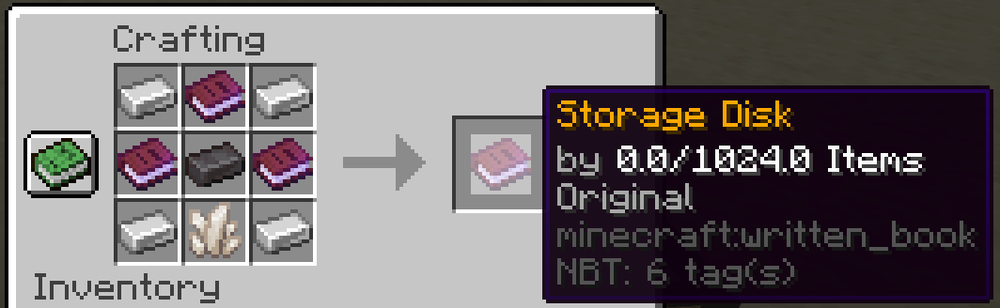
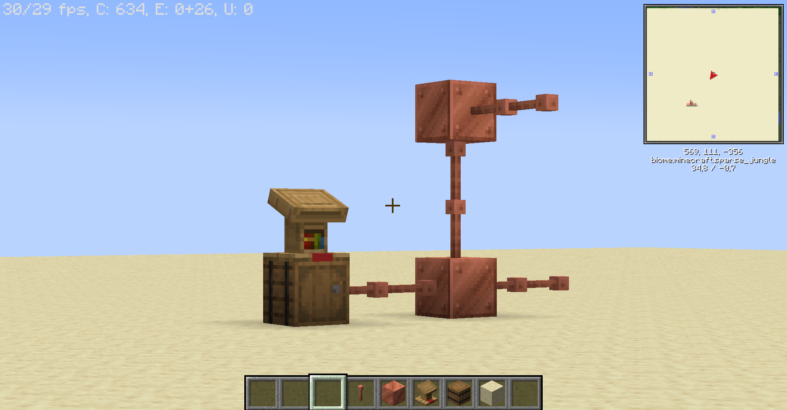
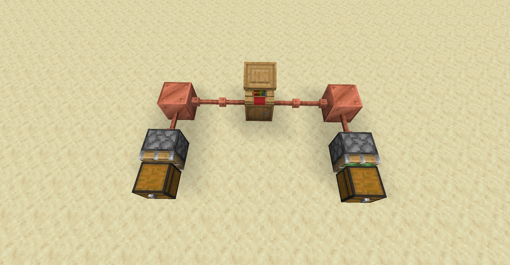

Die BlockNet genannten Lagersysteme sind eine einfache Möglichkeit, viele Gegenstände an einem Ort sicher aufzubewahren, mithilfe der `Data Discs` können auch größere Mengen an Gegenständen leicht von A nach B transportiert werden.

## 1. Controller
Die zentrale Einheit des Netzwerks. Der Controller kann mehrere Speicherplatten halten.
Um auf Gegenstände zuzugreifen, platziere einen Pult über dem Controller und klicke mit der rechten Maustaste darauf.

=== "Controller Rezept"
    
=== "Aufgestellter Controller mit Pult"
    !!! note ""
        Mit dem Pult können Gegenstände aus den Speicherplatten entnommen werden, die sich im Controller befinden, es handelt sich dabei um einen gewöhnlichen Pult, der auf den Controller gestellt wird.
    

## 2. Data Disks
Speicherplatten können über die Werkbank hergestellt werden.
Die Platten können auch in der Werkbank verbunden werden, um ihre Speicherkapazität zu verbessern.
Schaue in deinem Rezeptbuch nach, um das Rezept zu finden.
    
=== "Einfache Speicherplatte"
    
=== "Speicherplatte erweitern"
    
    
## 3. Verbindungen
!!! info inline end ""
    
    Verbindungen mittels Kupferverbindung
Netzwerke haben eine begrenzte Anzahl von Verbindungen.
Verbindungen können mit Blitzableitern und (gewachsten) Kupferblöcken erstellt werden. Kupferblöcke verbinden sich mit allen Seiten, während sich die Blitzableiter nur in einer gerade Linie verbindet. Wenn Kupfer oxidiert, wird die Verbindung unterbrochen. Stelle also sicher, dass du das Kupfer mit Wachs behandelst oder halte eine Axt bereit. 

!!! warning "Verbindungslimit"
    Die Kupferverbindungen kommen bei größeren Systemen an ihre Grenzen, Controller können derzeit nicht mehr als **1000 Verbindungen** erreichen. Im Controller Menü kannst du die derzeitige Größe des Systems überwachen.

## 4. Export und Import
Klebrige Kolben können Gegenstände importieren, während normale Kolben Gegenstände exportieren. Verwenden ein Konfigurationsschild, um die Kolben zu konfigurieren. Ein Exporter funktioniert nur, wenn ein Konfigurationsschild mit einer Whitelist angelegt ist. Der Importer funktioniert immer, aber du kannst ihn mit einem Konfigurationsschild bestimmte Gegenstände auf eine White- oder Blacklist setzen.

!!! note "Netzwerk mit Importer und Exporter"
    

## 5. Konfigurationsschild
Nachdem du das Konfigurationsschild auf oder an einen Kolben gestellt hast, kannst du mit Rechtsklick auf das Schild das Konfigurationsmenü öffnen, in diesem kannst du bestimmte Blöcke in eine White- oder Blacklist hinzufügen, welche von dem Kolben erfasst werden soll.

!!! note "Konfigurationsschild"
    
