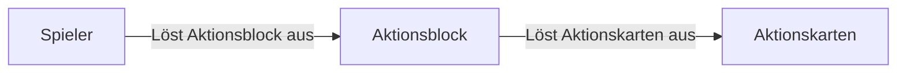

# Parkour Aktionskarten
Mit den Aktionskarten können verschiedene Aktionen ausgelöst werden. Jede Aktionskarte kann in einen Block mit einem Inventar gelegt werden, beispielweise eine Kiste.

### Aktionsblöcke
Jeder Block mit Inventar kann auch ein Aktionsblock sein, wird ein Knopf, ein Hebel oder eine Druckplatte über einem Block mit einem Inventar ausgelöst, werden alle Aktionskarten innerhalb des Blocks ausgelöst.

### Blockierende Aktionskarten
Jede Aktionskarte kann entweder blockierend oder nicht blockierend sein. Blockiert eine Aktionskarte, wird diese den Aktionsblock blockieren, bis die Aktion der Aktionskarte abgeschlossen ist. Ist die Aktionskarte nicht blockierend, wird diese nicht den Aktionsblock blockieren und anstelle direkt die nächste Aktionskarte auslösen.

### Aktionen
#### Verzauberung
:octicons-beaker-24: Verfügbar ab Level 3

#### Shulker Auslöser
:octicons-beaker-24: Verfügbar ab Level 5

#### Zeit
:octicons-beaker-24: Verfügbar ab Level 6

#### Wetter
:octicons-beaker-24: Verfügbar ab Level 8

#### Schwung
:octicons-beaker-24: Verfügbar ab Level 10

#### Temmporärer Block
:octicons-beaker-24: Verfügbar ab Level 15

#### Block
:octicons-beaker-24: Verfügbar ab Level 20

#### Wiederholen
:octicons-beaker-24: Verfügbar ab Level 25

#### Auslöser
:octicons-beaker-24: Verfügbar ab Level 30

#### Stopper
:octicons-beaker-24: Verfügbar ab Level 35

#### Warten
:octicons-beaker-24: Verfügbar ab Level 40

#### Plattform
:octicons-beaker-24: Verfügbar ab Level 45

!!! info inline end "Beispiel einer Plattform"

	{ align=right }

Plattformen können für verschiedene Zwecke genutzt werden, sie
können bis zu 28 Keyframes speichern, die sie nacheinander abfliegen
und somit den Spieler transportieren können. Die Plattformen können
einer linearen Linie, aber auch Bezier Kurven fliegen und sind in ihrer
Geschwindigkeit variabel anpassbar.

Man kann die Plattformen entweder einen Rundkurs fliegen lassen, oder auch
nur von A nach B fliegen lassen, entweder als einmalige Tour oder in einer Schleife.

