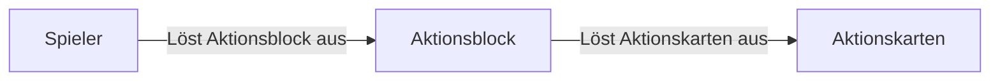

# Parkour Aktionskarten
Mit den Aktionskarten können verschiedene Aktionen ausgelöst werden. Jede Aktionskarte kann in einen Block mit einem Inventar gelegt werden, beispielweise eine Kiste.

### Aktionsblöcke
Jeder Block mit Inventar kann auch ein Aktionsblock sein, wird ein Knopf, ein Hebel oder eine Druckplatte über einem Block mit einem Inventar ausgelöst, werden alle Aktionskarten innerhalb des Blocks nacheinander ausgelöst.

### Blockierende Aktionskarten
Jede Aktionskarte kann entweder blockierend oder nicht blockierend sein. Blockiert eine Aktionskarte, wird diese den Aktionsblock blockieren, bis die Aktion der Aktionskarte abgeschlossen ist. Ist die Aktionskarte nicht blockierend, wird diese nicht den Aktionsblock blockieren und anstelle direkt die nächste Aktionskarte auslösen.

### Aktionen
#### Verzauberung
:octicons-beaker-24: Verfügbar ab Level 3

Nach Aktivierung wird der Spieler die gewählte Verzauberung für die gewählte Dauer und Stärke auf den Spieler aktiviert. Wählt man keine Verzauberung aus, werden alle Verzauberungen vom Spieler entfernt. Möchte man eine bestimmte Verzauberung vom Spieler entfernen, kann dafür die Stärke der Verzauberung auf 0 gestellt werden.

#### Shulker Auslöser
:octicons-beaker-24: Verfügbar ab Level 5

Wenn das Inventar einer Shulkerbox geöffnet wird, fahren sich die Shulker aus, die damit entstehenden Flächen können für zahlreiche Parkour Jumps oder als Hindernis genutzt werden.
Mit dem Shulker Auslöser kann eine Shulkerbox für einen frei wählbaren Zeitraum aus- und wieder eingefahren werden. In Kombination mit der Aktionskarte [Wiederholen](#wiederholen) am Ende in einem Aktionsblock können wie im Beispiel gezeigt unendlich oft wiederholende Aktionsketten ausgelöst werden.

=== "Plattform in der Wand"

    

=== "Lange Shulkerreihe"

    

=== "Schubsende Shulker"

    

#### Zeit
:octicons-beaker-24: Verfügbar ab Level 6

Damit du als Ersteller der Karte mehr Möglichkeiten hast, das Spielerlebnis zu verbessern, kannst du ebenfalls die Zeit beim Spieler beliebig verstellen. Wähle in der Aktionskarte die Uhrzeit, die du haben möchtest, wird die Aktionskarte ausgelöst, ändert sich die Zeit bei dem Spieler.

#### Wetter
:octicons-beaker-24: Verfügbar ab Level 8

Nicht nur die Zeit kann geändert werden, möchte man das Wetter beim Spieler nicht sonnig und wolkenfrei haben, kann man das Wetter mit der Wetter Aktionskarte verändern.

#### Schwung
:octicons-beaker-24: Verfügbar ab Level 10

Mit der Schwung Aktionskarte können Spieler in eine beliebige Richtung geschubst werden, im Menü können die dafür benötigten Vektor Parameter (X, Y, Z) definiert werden.

#### Temporärer Block
:octicons-beaker-24: Verfügbar ab Level 15

Der temporäre Block platziert sich und baut sich danach in der gewählten Geschwindigkeit ab. Den Ort des Blocks kannst du auswählen, indem du schleichst und mit Rechtsklick auf den gewünschten Block klickst. Die Dauer kann im Aktionskarten Menü gewählt werden.

#### Block
:octicons-beaker-24: Verfügbar ab Level 20

Der Block platziert sich dauerhaft, bis entweder der Run neugestartet, der Run beendet wird oder der Aktionsblock gestoppt oder resettet wird. Wie beim [Temporären Block](#Temporärer Block) kann man den Ort des Blocks auswählen, indem man schleicht und gleichzeitig mittels Rechtsklick auf den gewünschten Block klickt.
!!! note "Beachte"
	Die Blöcke werden nicht wirklich auf dem Server platziert, sondern dem Spieler nur als Fake Block angezeigt, einem Spieler einen Luft Block zu schicken wird eine bestehende Wand nicht durchlässig machen. Willst du eine Wand in einem Run entfernen, platziere diese zunächst mit der Block Aktionskarte, um diese anschließend mit einer weiteren Block Aktionskarte durch Luft zu ersetzen.

#### Wiederholen
:octicons-beaker-24: Verfügbar ab Level 25

Möchtest du einige Aktionskarten immer wieder wiederholen, kannst du diese Karte hinter die anderen Aktionskarten legen, das führt dazu, dass sich der [Aktionsblock](#aktionsblocke) wiederholen wird, bis dieser entweder erneut aufgerufen, oder unterbrochen wird.

#### Auslöser
:octicons-beaker-24: Verfügbar ab Level 30

Wenn dir eine Doppelkiste zu wenig Platz für alle deine Aktionskarten ist oder man komplexere Projekte umsetzen möchte, kann sich ein Auslöser lohnen. Mit dem Auslöser kann ein Aktionsblock einen weiteren Aktionsblock ausführen. Um einen Aktionsblock zu definieren, der mit dem Auslöser ausgelöst werden soll, schleiche und klicke mittels Rechtsklick auf den gewünschten Aktionsblock.

!!! note "Limitierung"
	Wenn ein Aktionsblock weitere Aktionsblöcke auslöst, werden die vom Aktionsblock ausgelösten Aktionsblöcke zu Kindern des Auslösers, wird der Auslöser beendet oder neugestartet, werden ebenfalls alle Kinder des Aktionsblocks beendet oder neugestartet.

#### Stopper
:octicons-beaker-24: Verfügbar ab Level 35

Manchmal möchte man vielleicht auch bereits laufende Aktionsblöcke beenden, mit dem Stopper kann man das machen. Wähle mit schleichen und Rechtsklick den Aktionsblock aus, der beendet werden soll und lege diesen in einen Aktionsblock deiner Wahl. Wird diese Aktionskarte ausgeführt, beendet diese den definierteen Aktionsblock.

#### Warten
:octicons-beaker-24: Verfügbar ab Level 40

Nicht alle Aktionen sollten immer in einem großen Vorgang abgeschlossen werden, mit der Warten Aktionskarte kann der Aktionsblock eine frei wählbare Zeit an Ticks warten, 20 Ticks entsprechen einer Sekunde, dadurch sind auch sehr feine Details möglich.

!!! note "Praktisch"
	Einige Aktionskarten blockieren die Ausführung weiterer Aktionskarten, möchte man selbst kontrollieren, wie lange der Aktionsblock wartet, kann man die Blockierung aus den Aktionskarten abschalten und nur die Warten Aktionskarten verwenden. Klicke dazu einfach auf das "Play" Symbol oben rechts in der Aktionskarte. Deaktivieren der Blockierung bei Warten Aktionskarten macht diese nutzlos.

#### Plattform
:octicons-beaker-24: Verfügbar ab Level 45

!!! info inline end "Beispiel einer Plattform"

	{ align=right }

Plattformen können für verschiedene Zwecke genutzt werden, sie
können bis zu 28 Keyframes speichern, die sie nacheinander abfliegen
und somit den Spieler transportieren . Die Plattformen können
einer linearen Linie, aber auch Bezier Kurven fliegen und sind in ihrer
Geschwindigkeit variabel anpassbar.

Man kann die Plattformen entweder einen Rundkurs fliegen lassen, oder auch
nur von A nach B fliegen lassen, entweder als einmalige Tour oder in einer Schleife.

